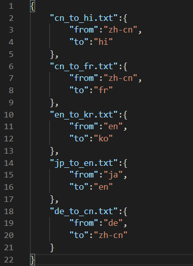
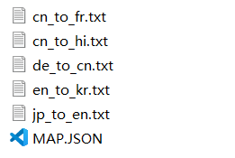
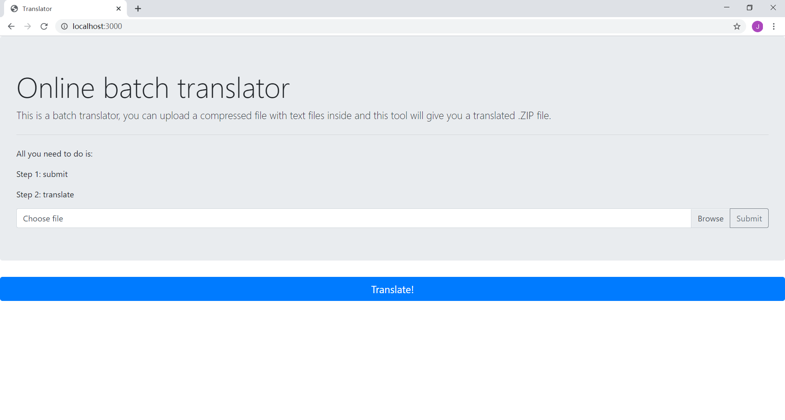
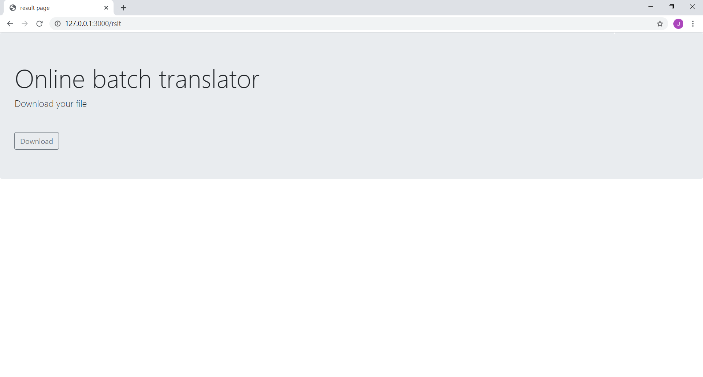

Run

"npm install"

in command line, wait a few seconds until all modules are installed, and then go to path:

"node_modules\google-translate-api"

and open

"index.js"

use "ctrl+f" find "client", change its value from "t" to "gtx", then save.

Do not remove the backend/unzipped_rslt directory!

# Description of the project
This is an online batch translator, it allows user to upload a *.zip* file that includes *.txt* message in foreign languages and a *MAP.JSON* file which specifies the language that understandable to user. Online batch translator will do its job and return a *.zip* file.  
# Things to do before run the code
Run  
`npm install`  
in command line, wait a few seconds until all modules are installed, and then go to path:  
*node_modules\google-translate-api*  
and open  
*index.js*  
press "ctrl+f" find "client", change its value from "t" to "gtx", then save.  

**Do not remove the backend/unzipped_rslt directory!**
# Features
#### Reliable Translation
This tool is powered by Google Translate API, which is the number one popular translator in the whole world, supporting over 103 languages and most importantly, free!
#### Batch Processing
User can compress several text files that s/he wants to translate in avoidance of translating them one by one in translate website.
# Overview of implementation
## Front end
>Using NodeJS and  
> * *fs*
> * *path*
> * *express*
> * *multer* 
> * *request*  
* 1. User uploads the *.zip* file from browser
* 2. Front end receives the *.zip* file and stores it in *./public*
* 3. Front end send the request along with *.zip* file to back end
* 4. Receives *result.zip* from back end, send it to user
## Back end
>Using NodeJS and  
> * *fs*
> * *path*
> * *express*
> * *compressing*
> * *zip-local*
> * *google-translate-api*
> * *iconv-lite*  
* 1. Receives the *.zip* file from front end
* 2. Call google-translate-api
* 3. Respond to front end
# link to video
[video link](https://youtu.be/Y8fFQSEkSaY)
# Screenshots of the demo
Here is an example of *MAP.JSON*:  
  
Notice that languages are represented by ISO language code here. (i.e. "zh-cn"=Simplified Chinese, "fr"=French)  
An example of *.zip*:  
  
The main page that you can upload:  
  
The result page that you can download:  
  
# Future work
#### A dropdown menu
A dropdown menu that user can specify which language s/he wants each of the text file to be translated to, hence no more manually configured *MAP.JSON* file are needed.
#### Error notification
If user press the translate button but forgot to upload file in the first place, the browser would notify user.